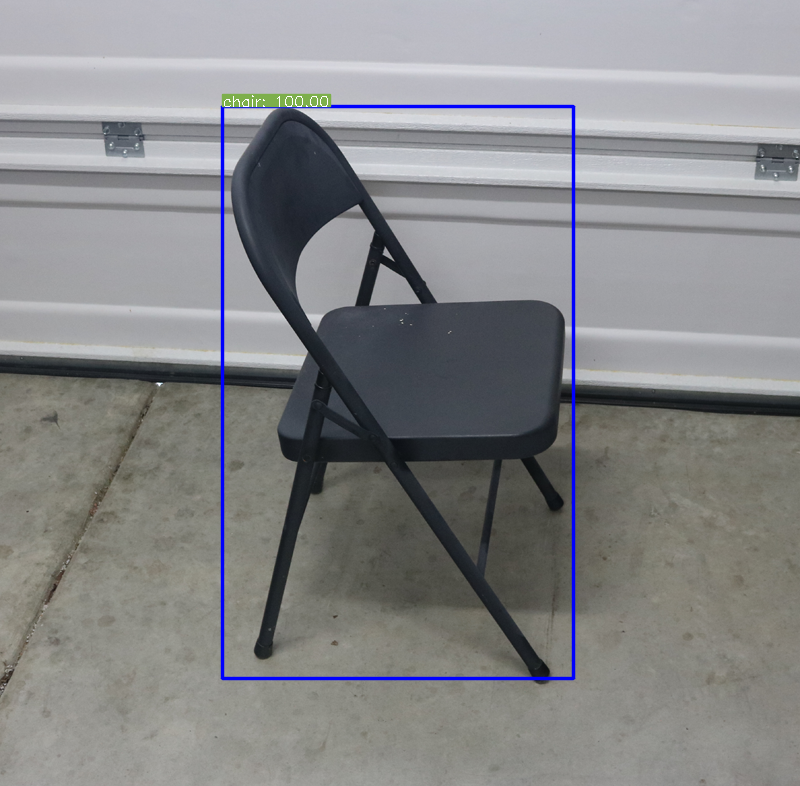

# Mobilenet SSD (Single Shot Detector) example

Example in this directory uses [Mobilenet SSD](https://github.com/chuanqi305/MobileNet-SSD) [tensorflow](https://www.tensorflow.org/) model to detect objects in provided image. For simplicity we used the following image of a chair:


## Prerequisites

Install [GoCV](https://github.com/hybridgroup/gocv/#how-to-install.)

This example uses C/C++ NCSDK 2.0, so make sure you have it installed by following the instructions [here](https://movidius.github.io/ncsdk/install.html)

Note, since the 2.0 API does not seem to work properly on macOS, you won't be able to run this example on macOS. Everything works fine on Linux, in particular this example was tested on `Ubuntu 16.04`

## Running the example

Note, the example program contains hardcoded paths to the compiled Movidius graph file of the SSD Mobilenet, the image of the char and the SSD Mobilenet labels.

You can run this example as follows:

```console
go run main.go
```

Result:

```console
2018/10/07 13:06:58 Attempting to create NCS device handle
2018/10/07 13:06:58 NCS device handle successfully created
2018/10/07 13:06:58 Attempting to open NCS device
2018/10/07 13:07:01 NCS device successfully opened
2018/10/07 13:07:01 Attempting to create NCS graph handle
2018/10/07 13:07:01 NCS graph handle successfully created
2018/10/07 13:07:01 Attempting to allocate NCS graph
2018/10/07 13:07:01 NCS Graph successfully allocated
2018/10/07 13:07:01 Attempting to read image nps_chair.png
2018/10/07 13:07:01 Attempting to queue nps_chair.png for inference
2018/10/07 13:07:01 nps_chair.png successfully queued for inference
2018/10/07 13:07:01 Attempting to read data from NCS
2018/10/07 13:07:01 Read suceeded. Read 1414 bytes
2018/10/07 13:07:01 Reading labels file: labels.txt
2018/10/07 13:07:01 Read 21 labels from labels.txt
2018/10/07 13:07:01 Detected boxes: 1
2018/10/07 13:07:01 Box at: 0: ClassID: chair Confidence: 100.00, Top Left: (222, 106) Bottom Right: (573, 678)
```

Once the program has finished running you'll find `result.png` image in the directory from which you launched the program:


